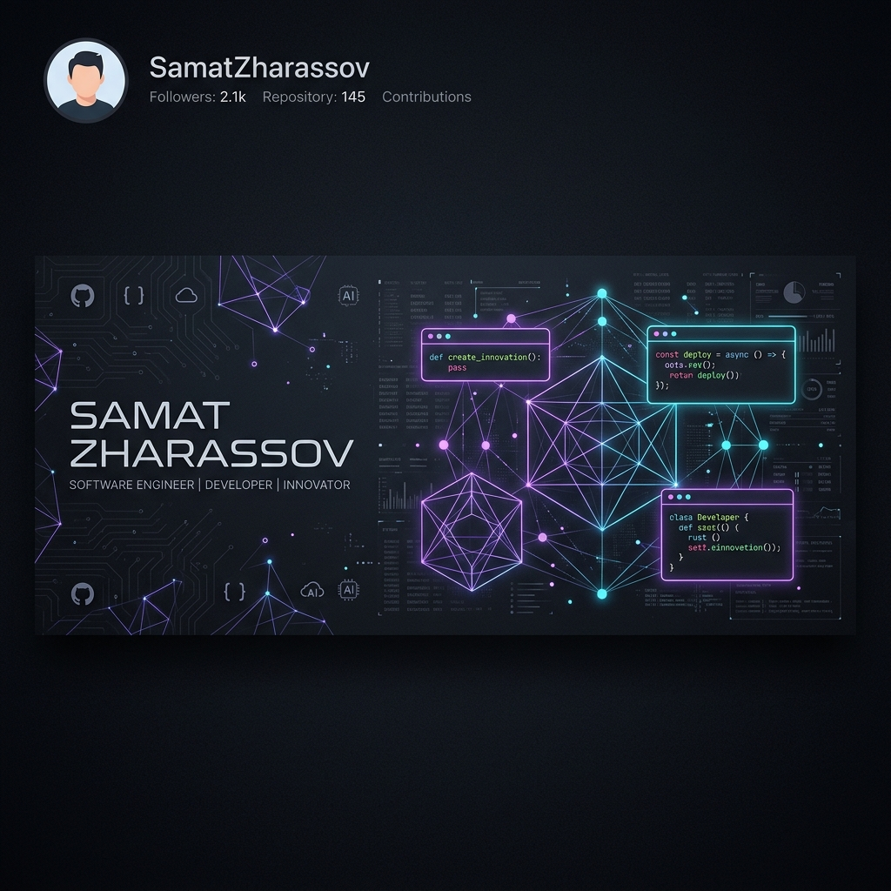

# Samat Zharassov 🚀

  
  
  <h3>✨ Bridging AI Agents, 3D Graphics, & Commercial Software Products ✨</h3>
  
  

    
    
    
  

---

### 👨‍💻 About Me
I am a passionate software engineer and creative builder specializing in constructing real-time AI agents, computer vision depth pipelines, and fully automated local build infrastructures. I thrive on shipping high-performance applications rapidly and scaling startup products.

*   🎓 **Education**: BS in Computer Science (Suffolk University, 2026)
*   🛠️ **Focus**: Cross-platform compilers, deep learning, 3D parallax computer vision, and local-first architectures.
*   🚀 **Active Core Focus**: Scaling startup products utilizing advanced AI agents to solve real-world industry pain points.

---

### 🚀 Featured Startup Products & SaaS

#### 🏡 [Shellfeed](https://shellfeed.com)
A revolutionary mobile real estate marketplace replacing standard filter grids with an engaging, personalized vertical swipe feed (similar to TikTok). 
- *Tech Stack*: Swift, GPT 5.4, Node.js, Supabase, Claude, Gemini Voice.
- *Status*: Live at **[shellfeed.com](https://shellfeed.com)**.

#### 🩺 [Hyqorra](https://hyqorra.replit.app/)
An automated compliance platform for healthcare AI. It intercepts and cryptographically traces every AI agent action, checking it in real time against approved clinical workflow rules.
- *Tech Stack*: React, AI Compliance logic, Healthcare Tech.
- *Status*: Live at **[hyqorra.replit.app](https://hyqorra.replit.app/)**.

#### 🛍️ [ShopReply](https://shopreply.org/)
An automated lead conversion platform for local service businesses and e-commerce. Instantly triggers customized AI SMS text-backs for missed customer phone calls and after-hours requests.
- *Tech Stack*: Twilio SMS routing, AI Agents, E-commerce APIs.
- *Status*: Live at **[shopreply.org](https://shopreply.org/)**.

---

### 🛠️ Technology Stack & Toolbox

| Category | Tech Stack & Frameworks |
| :--- | :--- |
| **Languages** | Python, JavaScript, TypeScript, Java, C++, C, HTML5/CSS3 |
| **AI & ML** | PyTorch, Hugging Face, transformers, Depth Anything V2, Stability AI (TripoSR) |
| **Graphics & 3D** | Blender API, 3D Reconstruction, 2.5D Parallax, Mesh Generation |
| **Web & App** | React, Vite, Node.js, Express, Gradio, TailwindCSS, Netlify/Vercel |
| **Tools & Databases** | Git, SQLite, PostgreSQL, SMS-driven architectures, Zero-Storage Sandboxes |

---

### 📂 Open Source Repositories

#### 🪄 [Wandalf-AI](https://github.com/samat2003/Wandalf-AI)
An AI software developer tool compiling and packaging fully native applications (.exe, .dmg) just by chatting with an AI agent.

#### 🛡️ [TrustLine Local](https://github.com/samat2003/trustline-local)
An instant, offline compliance scanner mapping AI codebase structures against 318+ frameworks (EU AI Act, FDA, HIPAA, NIST) in seconds via SMS.

#### 🌌 [Efficient 3D Models Depth Animation](https://github.com/samat2003/Efficient-3d-models-depth-animation)
A computer vision parallax animation generator converting static 2D images into 2.5D displacement layers in Blender using Depth Anything V2.

#### ⚡ [AssetWithAi](https://github.com/samat2003/AssetWithAi)
A lighting-fast, single-image 3D mesh generator wrapping Stability AI's TripoSR with a local Gradio web app.

---

### 📊 GitHub Stats & Metrics

  
  

---

  ✨ Designed with love by Samat Zharassov. Feel free to explore my repos and drop a 🌟 if you like my work! ✨

